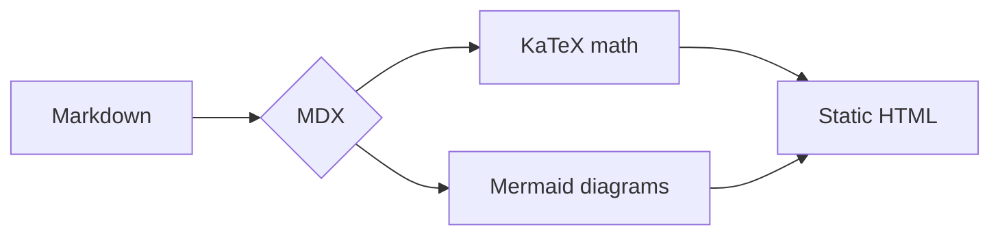

This is the first post on the new site. Built with [Astro](https://astro.build), styled with a monochromatic OKLCH palette, and typeset in Instrument Serif, Geist, and Ioskeley Mono.

More to come — writing about AI research, developer tools, and building things at the intersection of design and engineering.

## Math

Posts support LaTeX via KaTeX, inline like $e^{i\pi} + 1 = 0$ and as display blocks:

$$
\operatorname{Attention}(Q, K, V) = \operatorname{softmax}\!\left(\frac{QK^\top}{\sqrt{d_k}}\right) V
$$

## Diagrams

And Mermaid diagrams:

